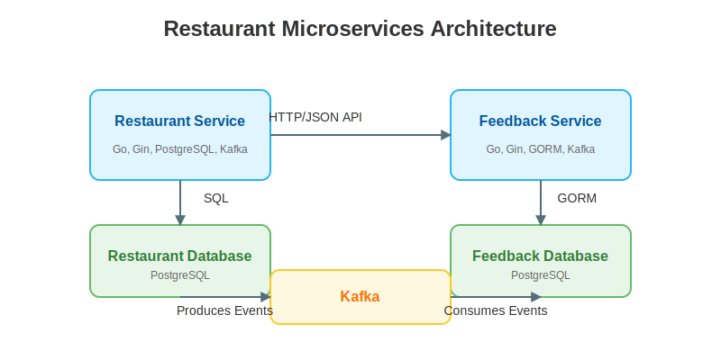

# 🍽️ Restaurant Microservices Architecture 

[](https://golang.org/)
[](https://github.com/gin-gonic/gin)
[](https://kafka.apache.org/)
[](https://www.postgresql.org/)
[](https://www.docker.com/)

> 🚀 A modern, scalable restaurant ordering system built with microservices

This project demonstrates a microservices architecture for a restaurant ordering system. The system consists of two primary microservices that communicate asynchronously via Kafka, showcasing best practices for distributed systems design.

## 🏗️ Architecture Overview

<div align="center">
  
</div>

<details>
<summary>View ASCII Architecture Diagram</summary>

```
┌─────────────────────┐     ┌──────────────────┐
│                     │     │                  │
│  Restaurant Order   │     │  User Feedback   │
│     Service         │◄────┤     Service      │
│                     │     │                  │
└─────────┬───────────┘     └──────────┬───────┘
          │                            │
          │                            │
          ▼                            ▼
┌─────────────────────┐     ┌──────────────────┐
│                     │     │                  │
│  Restaurant DB      │     │   Feedback DB    │
│   (PostgreSQL)      │     │   (PostgreSQL)   │
│                     │     │                  │
└─────────────────────┘     └──────────────────┘
          ▲                            ▲
          │                            │
          └────────────┬───────────────┘
                       │
                       ▼
              ┌─────────────────┐
              │                 │
              │      Kafka      │
              │                 │
              └─────────────────┘
```
</details>

## 🔍 Services Description

### 🍲 Restaurant Ordering Service

| Feature | Description |
|---------|-------------|
| **Features** | Authentication, food menu, ordering, transactions |
| **Tech Stack** | Go, Gin, PostgreSQL (SQL), Kafka Producer |
| **API Port** | 8080 |
| **Database** | PostgreSQL on port 5434 (mapped to container's 5432) |

### 🌟 User Feedback Service

| Feature | Description |
|---------|-------------|
| **Features** | Feedback collection and analysis for orders |
| **Tech Stack** | Go, Gin, PostgreSQL (GORM), Kafka Consumer |
| **API Port** | 8081 |
| **Database** | PostgreSQL on port 5433 (mapped to container's 5432) |

## 🌊 Data Flow

<div align="center">
  
</div>

1. 👤 A user places an order through the Restaurant Ordering Service
2. 💳 Once the transaction is completed, the order event is published to Kafka
3. 📡 The User Feedback Service consumes the order event from Kafka
4. 📝 The user can now submit feedback for the order through the Feedback Service
5. 📊 All feedback is stored and analyzed by the Feedback Service

## 📋 Prerequisites

- 🐳 Docker and Docker Compose
-  Go 1.22 or later (for local development)
-  Git

## 🚀 Getting Started

### Setup and Deployment

#### Step 1: Clone the Repository

```bash
git clone <repository-url>
cd go_microsvc
```

#### Step 2: Start All Microservices

```bash
docker-compose up -d
```

#### Step 3: Verify the Deployment

```bash
./verify_deployment.sh
```

#### Step 4: Run Integration Tests

```bash
./test_microservices.sh
```

### 💻 Development Environment

<details>
<summary>Running Individual Services for Development</summary>

```bash
# For Restaurant Ordering Service:
cd restaurant_ordering_service
docker-compose up -d

# For User Feedback Service:
cd user_feedback_service
docker-compose up -d
```
</details>

<style>
.steps-container {
  display: flex;
  flex-wrap: wrap;
  gap: 15px;
  margin: 20px 0;
}
.step {
  flex: 1;
  min-width: 300px;
  padding: 15px;
  border: 1px solid #ddd;
  border-radius: 5px;
  background-color: #f9f9f9;
  box-shadow: 0 2px 5px rgba(0,0,0,0.1);
}
.step h4 {
  margin-top: 0;
  border-bottom: 2px solid #4CAF50;
  padding-bottom: 5px;
}
</style>

## 📘 API Documentation

### 🍽️ Restaurant Ordering Service (port 8080)

#### 🔑 Authentication

**POST /auth** - Authenticate a user and get a JWT token

<details>
<summary>Example Request</summary>

```json
{
  "username": "testuser",
  "password": "password123"
}
```
</details>

#### 🍔 Food Items

**GET /food-items** - Get list of available food items

#### 👤 User Profile

**GET /profile** - Get authenticated user's profile (Requires JWT)

#### 📋 Orders

**POST /orders** - Place a new order (Requires JWT)

<details>
<summary>Example Request</summary>

```json
{
  "items": [
    {"food_item_id": 1, "quantity": 2},
    {"food_item_id": 3, "quantity": 1}
  ]
}
```
</details>

#### 💳 Transactions

**POST /transactions** - Complete a transaction for an order (Requires JWT)

<details>
<summary>Example Request</summary>

```json
{
  "order_id": 1
}
```
</details>
</div>


### 🌟 User Feedback Service (port 8081)

#### 🔑 Authentication

**POST /auth** - Authenticate a user and get a JWT token

<details>
<summary>Example Request</summary>

```json
{
  "username": "testuser",
  "password": "password123"
}
```
</details>

#### 📝 Feedback Management

**POST /feedback** - Submit feedback for an order (Requires JWT)

<details>
<summary>Example Request</summary>

```json
{
  "order_id": 1,
  "rating": 5,
  "comment": "Great service!"
}
```
</details>

**GET /feedback** - Get all feedback from the authenticated user (Requires JWT)

**PUT /feedback/:id** - Update feedback (Requires JWT)

<details>
<summary>Example Request</summary>

```json
{
  "rating": 4,
  "comment": "Good service but could be better"
}
```
</details>

**DELETE /feedback/:id** - Delete feedback (Requires JWT)

#### 📊 Analytics

**GET /feedback/stats** - Get feedback statistics (Requires JWT)

<style>
.put {
  background-color: #fca130;
  color: white;
}
.delete {
  background-color: #f93e3e;
  color: white;
}
</style>

## 🧪 Testing

### 🔍 Deployment Verification

The `verify_deployment.sh` script checks if all services and connections are working correctly.

```bash
./verify_deployment.sh
```

### 🔄 Integration Tests

The `test_microservices.sh` script performs end-to-end integration tests across all services.

```bash
./test_microservices.sh
```

## 📁 Project Structure

```
go_microsvc/
├── 📄 docker-compose.yml            # Main container orchestration
├── 📄 test_microservices.sh         # Integration test script
├── 📄 verify_deployment.sh          # Deployment verification script
├── 📁 restaurant_ordering_service/  # Restaurant ordering service
│   ├── 📁 cmd/                      # Service entry point
│   ├── 📁 internal/                 # Service implementation
│   │   ├── 📁 api/                  # API handlers
│   │   ├── 📁 db/                   # Database operations
│   │   ├── 📁 kafka/                # Kafka producer
│   │   ├── 📁 middleware/           # Service middleware
│   │   └── 📁 models/               # Data models
│   ├── 📄 .env                      # Environment variables
│   ├── 📄 Dockerfile                # Container definition
│   └── 📄 go.mod                    # Go module file
└── 📁 user_feedback_service/        # User feedback service
    ├── 📁 cmd/                      # Service entry point
    ├── 📁 internal/                 # Service implementation
    │   ├── 📁 api/                  # API handlers
    │   ├── 📁 db/                   # GORM database operations
    │   ├── 📁 kafka/                # Kafka consumer
    │   ├── 📁 middleware/           # Service middleware
    │   └── 📁 models/               # Data models
    ├── 📄 .env                      # Environment variables
    ├── 📄 Dockerfile                # Container definition
    └── 📄 go.mod                    # Go module file
```

<style>
.testing-section {
  display: flex;
  flex-wrap: wrap;
  gap: 20px;
  margin: 20px 0;
}
.test-card {
  flex: 1;
  min-width: 300px;
  display: flex;
  border: 1px solid #ddd;
  border-radius: 8px;
  padding: 15px;
  background-color: #f9f9f9;
  box-shadow: 0 2px 5px rgba(0,0,0,0.1);
}
.test-icon {
  font-size: 2em;
  margin-right: 15px;
  display: flex;
  align-items: center;
}
.test-content {
  flex: 1;
}
.test-content h4 {
  margin-top: 0;
  margin-bottom: 10px;
  color: #333;
}
.test-command {
  background-color: #f0f0f0;
  padding: 8px 12px;
  border-radius: 4px;
  margin-top: 10px;
  display: inline-block;
}
.directory-structure {
  background-color: #f8f9fa;
  border-radius: 8px;
  padding: 15px;
  box-shadow: inset 0 0 5px rgba(0,0,0,0.1);
  overflow-x: auto;
}
</style>

## 📝 Notes

- 🍔 All food items are initialized with 1000 units of quantity and a price of 10.
- 👤 A default test user is created with username `testuser` and password `password123`.
- 🔐 For simplicity, authentication uses plain text password comparison.
- 🏛️ The project demonstrates key microservices principles:
  - **Service Independence**: Each service has its own codebase and database
  - **Decentralized Data**: Each service manages its own data
  - **Async Communication**: Services communicate via events through Kafka
  - **Tech Diversity**: Different database approaches (SQL vs GORM)
  - **Independent Deployment**: Each service can be deployed separately

## 🔮 Future Improvements

1. 🔀 **API Gateway**: Add an API gateway for routing and cross-cutting concerns
2. 🔍 **Service Discovery**: Implement service registry for dynamic service discovery
3. 🛡️ **Circuit Breakers**: Add resilience patterns to handle service outages
4. 🔍 **Distributed Tracing**: Implement tracing to monitor request flows
5. 📊 **Centralized Logging**: Set up centralized logging across services

---

🍽️ Restaurant Microservices Architecture - Developed with ❤️ using Go and Kafka
